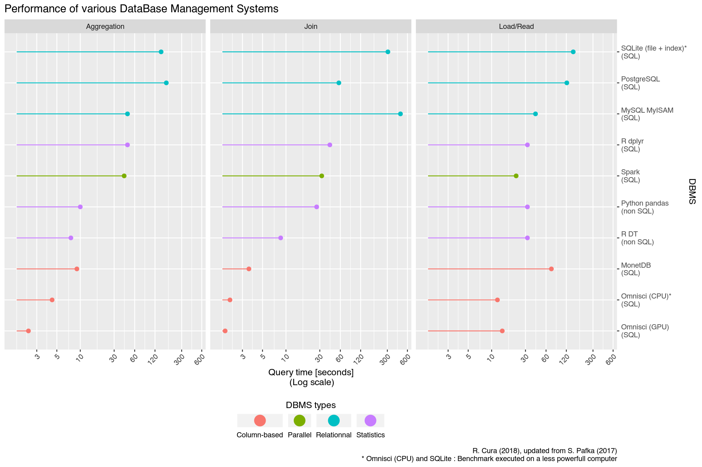
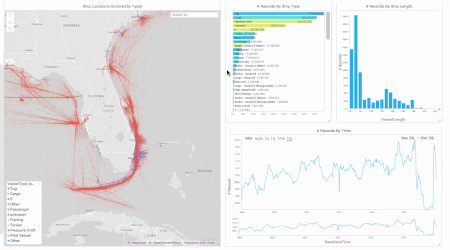
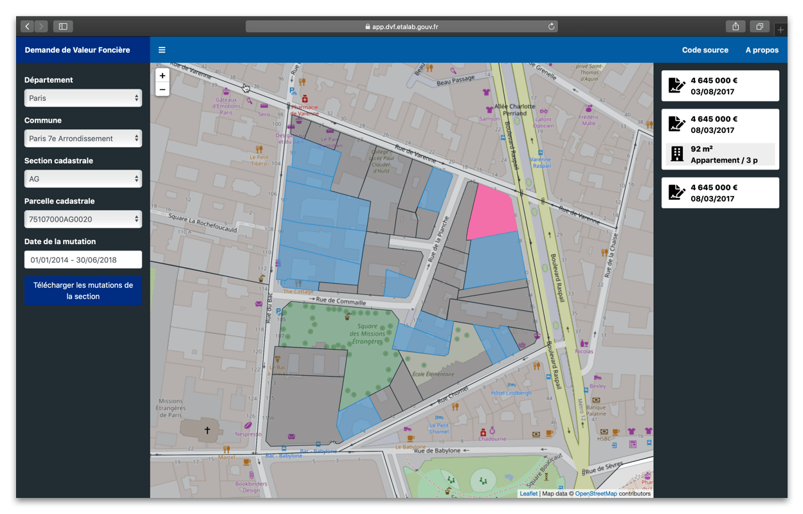
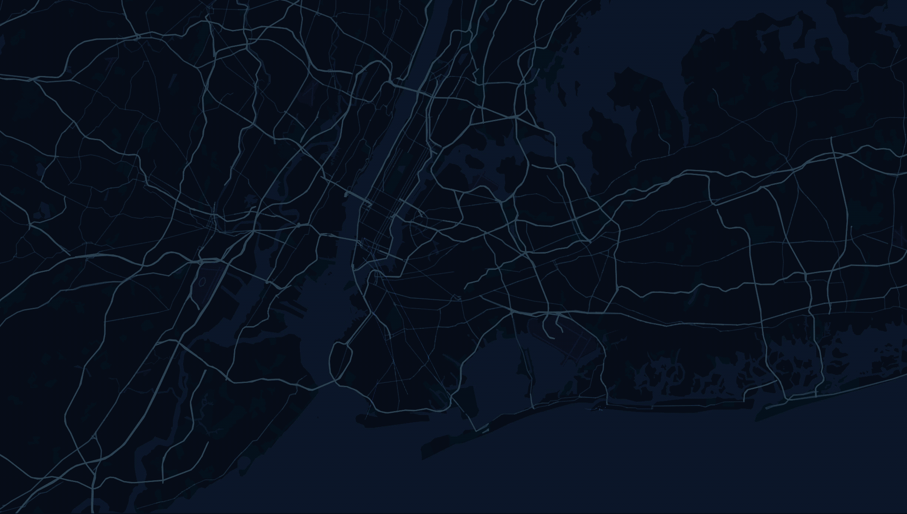
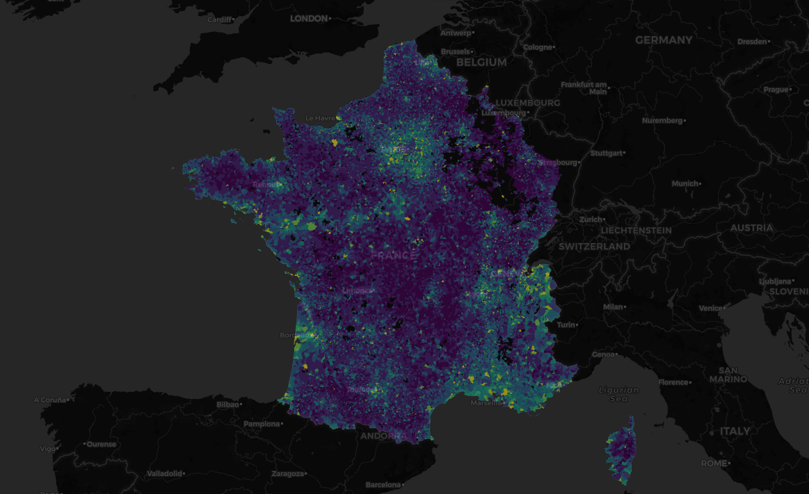

layout: true

<html><div class="my-footer"><div>Robin Cura</div><div>ECTQG 2019</div><div>06 September 2019</div></div></html>

---
class: inverse, center, top

.pull-left[

]
.pull-right[

]

<br />
<br />

# Enriching Exploratory Spatial Data Analysis with modern computer tools

<html><div style='float:left'></div><hr color='#EB811B' size=1px width=720px></html>

<br />
### Robin CURA, PhD Student in Geography
### Univ. Paris 1 Panthéon-Sorbonne & Géographie-cités laboratory 

.center[

]

---
class: inverse, middle, center

# Handling massive data sources with classical tools

---
# An intermediate kind of data

## Handling the recent  .highlight-box-yellow[massive data] sources

.pull-left[
### ~~"Big Data"~~

* Data that can't fit on a personnal computer
* Few evolutions in the last years
* Still the usual distributed computing solutions : Hadoop, Apache Spark
* Still hard to grasp for non computer scientists
]

.pull-left[
### Traditionnal ~~large data~~
e.g. census data, territorial mesh data etc.

* Can be managed in most analysis softwares
* Often adapted for spreadsheets, GIS, GUI softwares (GeoDA...) etc.
* Can also be analyzed with CLI analysis tools like R or Python (cf. yesterday's workshop)
]

### What lies in-between these dataset types ?


---
# An intermediate kind of data

.small[

| Data                         	|               	|                                                                       	| Storage and analysis                             	|                                                                          	|
|------------------------------	|---------------	|-----------------------------------------------------------------------	|--------------------------------------------------	|--------------------------------------------------------------------------	|
| Quantity                     	| Memory size   	| Examples                                                              	| Storage infrastructure                           	| Analysis and visualization tools                                         	|
| Up to 1,000 rows             	| ~1 MB         	| Aggregated census data                                                	| Text file                                        	| Spreadsheets, GIS                                                       	|
| 1,000-100,000 rows           	| ~1-50 MB      	| Detailed Census data                                                  	| Text files                                                  	|  GIS, GUI software (GeoDA, Tableau...) etc.                                                                          	|
| 100,000 – a few million rows 	| ~50 MB – 1 GB 	| Individual data, time series of multiple sensors                      	| Spreadsheet or binary files (SHP, geopackage...) 	| Interactive (GUI) statistical tool or Command-Line Interface (CLI) tools 	|
| 10 to 100 million rows       	| ~1 - 10 GB    	| Many new open datasets : equipments, user-generated content, VGI etc. 	| **???**                                              	| **???**                                                                      	|
| > 100 million rows           	| > 10s of GB   	| Spatio-temporal data, automated reporting, big companies datasets ... 	| Distributed Databases                            	| High-Performance Computing                                               	|

]

---
# Handling massive data

### It's not really a new problem

* Traditionnal handling : relational DMBS, e.g. MySQL, PostgreSQL, SQLite
  * Great for :
		* archiving large data
		* multiple users and concurrent queries
		* updatability
		* diversity of types and queries
		* customisation
		* universality through SQL
	* Issues with : **speed**
		* install/setup : can't be setup in a few minutes
		* data import : made for updating, slow for massive imports
		* queries : row-based DMBS : slow for global data aggregates/joins

**Traditionnal relationnal DBMS are not that good a fit for Exploratory Data Analysis (EDA).**

* Mostly a single-user context, requiring many back and forth between global structure and peculiarities  


---
# A few benchmarks



---
# Using the new generation of colum-based DBMS 

### Advantages :
* Easy to setup
* Fast for data insert
* Fast (extremely) for column-based operations : agregation, joins
* Can be queried through SQL (at least some of them)

### Weaknesses :
* Not performant for upserts and data updates
* Not as mature as relational DBMS : still the state of the art, although used a lot by big tech companies
* Less operators/flexibility on queries (especially spatial queries : nothing can reach PostGIS spatial queries)


---
# An example of a columnar DBMS

### Presenting the example of Omnisci (former MapD), an open-source* columnar DBMS

* A DBMS made for GPU processing :
  * Can query hundreds of billions of rows in a blink
  * When it is run on an adapted hardware configurations : high-end GPUs etc.
  * Check [www.omnisci.com/demos](www.omnisci.com/demos) : 
  
.center[

]

  * Still works very well for 10⁶-10⁸ rows-data on an aging personnal computer without GPU

---
# Illustrating an EDA approach using Omnisci

### Example dataset :
The recent governement opendataset on real estate transactions : the DVF ("Demande de Valeurs Foncières")
* Logs all (public and private) real estate transactions on *almost* all of France
* Detailed geolocation : cadastral parcel (e.g. big as a building)
* Detailed price for each transaction, with the corresponding informations on the real estate types, area and composition
* Yearly, since 2014

.pull-left[

]

.pull-right[
* 1 year : ~ 3M rows : easy to manage through CLI
* 5 years (2014-2018) : ~15M rows, doesn't fit in memory
* A good candidate for a quick test/demo
]

---
# Illustrating an EDA approach using Omnisci

## Preparing the DBMS :
* Run through Docker container :
.small[`docker run -name testdb -d -v $HOME/omnisci-docker-storage:/omnisci-storage -p 6273-6280:6273-6280 omnisci/core-os-cpu`]
* Prepare the database :
  * Log to Omnisci container : .small[`docker container exec -ti testdb /bin/bash`]
  * Run the sql shell and create the table :
.small[
```sql
CREATE TABLE dvf ( id_mutation TEXT, annee SMALLINT, [...]);
```
]
  * Populate the table : .small[`COPY dvf FROM '/data/dvf_2014-2018.csv.gz';`] (~couple minutes)
  * Verify that the data looks correct (sub-seconds query)
  
```
omnisql> SELECT COUNT(*) AS n_rows FROM dvf;
> n_rows
> 13 255 975
```
#### The full DB infrastructure can be setup in a few lines and ready in a few minutes

---
# Exploring the database with R

#### Omnisci has a SQL interface, through ODBC/JDBC  
  -> It can be interactively queried from both R (using `RJDBC`) and from Python (`pymapd`)  
  -> Here, examples using R and tidyverse-style piped queries through the common database connection `DBI`

.small[
```{r, eval = FALSE, echo= TRUE}
# Connecting to the DB #<<
db_connection <- DBI::dbConnect(drv = db_driver, [credentials],
                                url = "jdbc:omnisci:localhost:6274:omnisci")
# Loading the table
dvf_data <- tbl(src = db_connection, "dvf") #<<
dvf_data
```
]

.tiny[
```{r, eval = TRUE, echo= FALSE, out.width = 150}
options(width = 150, tibble.width = 150)
# Loading required packages #<<
suppressPackageStartupMessages({
library(tidyverse) # Data manipulation,
# works both with local data or through db connections
library(DBI) # Generic database connexion interface
options( java.parameters = c("-Xss2560k", "-Xmx4g") ) # Ensure Java gets enough memory
library(RJDBC) # Generic Java Database Connectivity
})
# Connection to the DB #<<
db_driver <- JDBC(driverClass = "com.omnisci.jdbc.OmniSciDriver",
                  classPath = "~/omnisci-jdbc-4.7.1.jar",
                  identifier.quote = "'")
db_connection <- dbConnect(drv = db_driver,
                           url = "jdbc:omnisci:localhost:6274:omnisci",
                           user = "admin", password = "HyperInteractive")
# Connection to the table and querying it #<<
dvf_data <- tbl(src = db_connection, "dvf")
dvf_data
```
]
---

# Exploring the database with R
  
#### Basic EDA
.small[
```{r, eval = FALSE}
dvf_data %>% group_by(annee, mois) %>%
  summarise(nb_transactions = n(), meanPrice = mean(valeur_fonciere, na.rm = TRUE)) %>%
  ungroup() %>% arrange(annee, mois) %>%
  collect() %>%  # Run computations inside the DB , retrieve the results locally #<<
  gather(Var, Value, -annee, -mois) %>%
  ggplot() + aes(mois, Value, fill = mois) +geom_col() +
  facet_grid(Var~annee, scales = "free_y")
```
]

###### Mean transaction price and number of transaction through months and years
.center[
```{r, eval = TRUE, echo = FALSE, fig.asp= 0.3, fig.width=15}
dvf_data %>%
  group_by(annee, mois) %>%
  summarise(nb_transactions = n(),
            meanPrice = mean(valeur_fonciere, na.rm = TRUE)) %>%
  ungroup() %>%
  arrange(annee, mois) %>%
  collect() %>%
  gather(Var, Value, -annee, -mois) %>%
  ggplot() +
  geom_col(aes(mois, Value, fill = factor(mois))) +
  scale_x_continuous(name = "Months", breaks = 1:12) +
  scale_fill_viridis_d(end = .85, guide = FALSE) +
  facet_grid(Var~annee, scales = "free_y")
```
]

---
class: middle, center

## Handling massive data sources with classical tools
 * #### Many new-generations DBMS (NoSQL, graph DB, collection/document DB etc.)
 * #### Among these, the relational column-based DBMS can offer a known and almost-universal interface (SQL) and integrate very easily our already existing workflows for EDA
 * #### This allows to scale up, for a few order of magnitudes, the amount of data that *any* quantitativist geographer can now analyse
 * #### Omnisci (but likewise Yandex's ClickHouse, MonetDB, Amazon Redshift, DuckDB, Uber's AresDB (soon) etc.) offers a quick-to-setup interface to managing such data

---
class: inverse, middle, center

# What about spatial data visualisation ?

---
# What about spatial data visualisation ?

### Often requires visualization of the spatial data
* Huge historical strength of GIS
  * Very good interaction with DBMS (e.g. QGIS was conceived as a PostGIS viewer)
	* Still disruptive inside an EDA CLI-based workflow

* CLI (Python/R) :
	* Many static visualisations : plot(SPDF), matplotlib, geoPandas.plot, ggplot2(sf) etc.
	* Yet, Shneiderman's mantra : *"Overview First, Zoom and Filter, Then Details-on-Demand"*

* For a few years, domination of Leaflet :
  * Vectorial data allows powerfull interactions
  * Limited in data quantities
	* Use of raster- (or vector-) tiles to handle larger data
	* Lacks of interactivity

---
# What about spatial data visualisation ?

##### Main problem : Leaflet can't support CLI-size data :
.small[
* Hard to display/interact with more than a few hundreds polygons (~ a few thousands points)
]

##### A very simple example of the limits :
.small[
* The DVF dataset cannot be rpresented at France's scale, only at the "département" level
* To add simple spatial visualisations of the DB-stored DVF dataset, we would need to use a GIS...
]

##### At the same time
.small[
* Many new technologies allow for webGUI-based analysis : MapboxGL, DeckGL, KeplerGL etc...
* As much / more performant than GIS or any local software
]
.center[
 
]

---
# What about spatial data visualisation ?

### Both R and Python can use performant visualisation solutions :

.pull-left[
* PyOpenGL
* PyViz stack (Bokeh, Holoviews, hvPlot...)
* Plotly
* mapboxgl-jupyter
]

.pull-right[
* RGL
* Plotly
* mapdeck
* leafgl
]

### Focus on leafgl (R)
* The versatility of leaflet (a wrapper around the Leaflet.glify JS library)
* Ability to interact with thousands of spatial entities
*  Without leaving the CLI environment
.center[

]
---
# What about spatial data visualisation ?

## An example with our DVF dataset :
* Aggregation on the ~36000 "communes"-scale
* Computing the mean square-meter price of the transaction for all years

*N.B.* : it can also be integrated inside more complete and ad-hoc applications (Shiny, Dash, Bokeh...)

.small[
```{r, eval = FALSE, results='hide', cache = TRUE}
# [...] Preparing the data and loading the usual spatial packages
# [...] Discretizing the values
# Making the map
leaflet() %>%
    addProviderTiles(provider = providers$CartoDB.DarkMatter) %>%
    addGlPolygons(data = map_data, color = communes_colors) # replaces leaflet::addPolygons #<<
```
]

---
# Example
.center[

]
---
class: middle, center
# Enriching ESDA with modern tools

## Conclusion :
* #### Intermediate solutions for intermediate data quantities exist
* #### Easy to setup/understand, doesn't require much computer science skills or computing power
* #### Just one small step ahead what you saw at yesterday's workshop
* #### Don't get blocked by data that are "a bit too big"

```{r, echo = FALSE, results='hide'}
dbDisconnect(db_connection)
rm(db_connection, db_driver, dvf_data)
#pagedown::chrome_print("20190906_CURA_ECTQG2019.html")
#servr::daemon_stop(1)
```